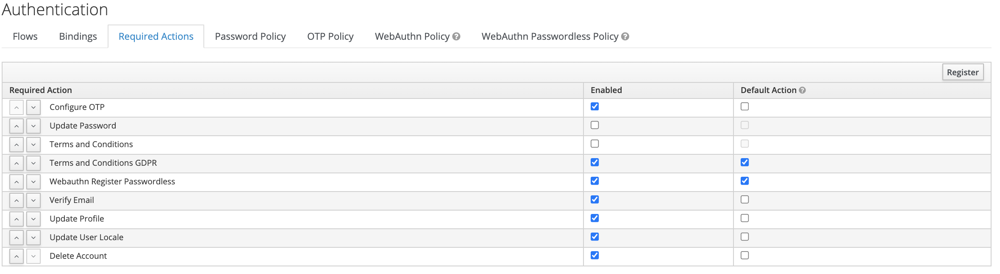

# 1. Technology
The jboss keycloak [Docker image](https://hub.docker.com/r/jboss/keycloak) has been used for this project. The docker container is build and started using docker-compose.
For deployment an AWS EC2 Instance has been used.

# 2. Modifications in Keycloak

## 2.1 Styling change
An own styling theme (hm-login) was developed with the following changes and configurations:
### 2.1.1 GDPR compliance
Due to the GDPR regulations, it is necessary to add a privacy policy. This can be found in the "Terms.ftl" within the new hm-login theme. This GDPR regulations need to be accepted by every user registering himself. Accepting this compliance is required from every user registering in Keycloak.

### 2.1.2 Login reset functionality
The form used for reset token is the form for resetting credentials. However, the displayed text in the UI for resetting tokens was "reset password". As tokens are used instead of passwords, this UI message was overwritten and changed to "Lost token or problems logging in?" in the "login-reset-password.ftl".

## 2.2. Modifications in the Keycloak Core

### 2.2.1 Reset Webauthn Token Flow
Keycloak didn't provide any logic to reset tokens used for authentication. This required modifications, that build using the logic for resetting passwords.
Therefore a new module named "reset-webauthn" has been created and added to the project. With it, it is possible to reset the token properly.

### 2.2.2 Autoremoving user declining the privacy policy
To be compliant with the GDPR a user has to be removed from the keycloak database if he declines the privacy policy. Therefore the TermsAndConditions-logic was enhanced to meet these requirenments. The new logic is part of the "reset-webauthn"-module.

### 2.2.3 Misuse of interrupted registration and token change processes 
Before applying the changes, every user was able to set a token whenever a registration or token change process was interrupted. Only the username was required to set a new token as a (potentially malicious) user. Solution: New authentification method was introduced. Using the "WebAuthnPasswordlessAuthenticatorFactory" as a base, a part of the class was overwritten and "isUserSetupAllowed" now returns false. 

## 2.3. SSL
To use HTTPS, when accessing Keycloak, the [Traefik-Proxy](https://doc.traefik.io/traefik/) has been used. It has been added in the docker-compose.yml.

## 2.4. Modifications in the Keycloak admin console

Inside the admin console, some changes were necessary as well. This included adding three new Flows:

**Realm settings - Login**

**Realm settings - Themes**

**New Registration Flow**

**Login Flow**

**New Reset Credentials Flow**

**Required Actions**

As one can see, a Webauthn Token is now the prefered way to register and login a user.
